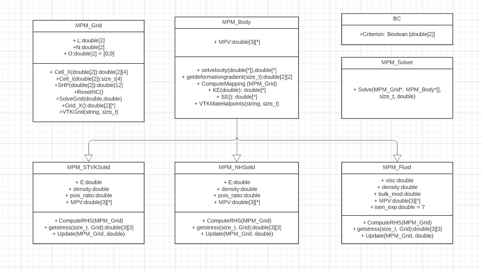

# Material Point Method - 2D
This project showcases the ability of Material Point Method by studying a variety of problems in solid and fluid mechanics, which involves large deformation, contact and fluid-solid interaction. The results are also benchmarked with literatures to verify the implementation of the code. Two solid model and one fluid model is implemented. The constitutive laws used for solids are St. Venant-Kirchoff law and Neo-Hookean law. For fluids a weakly compressible fluid-solver is used for updating stresses and the pressure is updated by an artificial equation of state. A Velocity-Verlet time integration scheme is used for temporal discretization.

# Code structure
This MPM solver is written in C++ and has a grid class, a body class and a solver class. The body class inherits three subclasses, two solid-solver classes with St.Venant Kirchoff and Neo-Hookean material laws respectively and a fluid solver subclass. The solver returns a batch of vtk file and the post-processing is performed in paraview. An API is also developed using pybind11 to widen the scope of postprocessing. The UML diagram for the project is shown below.



## Description

`MPM_Grid`: Defines the Cartesian grid and discretizes it into cells

`MPM_Solver`: Updates the state variables at the end of each time step by Update Stress Last (USL) Algorithm

`BC`: Enforces the boundary conditions onto the grid

`MPM_Body`: Defines the body and discretizes it into material points. It also assembles the global matrices and returms the vtk files. The body can be discretized only into simple geometries of rectangle and circle. Material point discretization is done by function calls from the below files

```
mpm_rect.py
mpm_circ.py
```
The parent class inherits the below three children classes,

`MPM_STVKSolid`: Updates the stress following St. Vernant-Kirchoff material law. 

`MPM_NHSolid`: Updates the stress following Neo-Hookean material law. Generally preferred for large deformations.

`MPM_STVKSolid`: Updates the stress following aforementioined constitutive law. The bulk modulus value influences the compressibiliy of the fluid.

# USL Algorithm
At first, the mass, volume, velocity, force of each material point is mapped onto the respective grid nodes. Then the parameters are transformed into nodal values using shape functions. These local nodal values are assembled into the global matrices and the momentum equations are solved on the grid. The obtained nodal values are then remapped to the material points with which, the position of the material points is updated. The algorithm flow is shown below.

<p align="center">
  
</p>

# Test-Results

## 1D Spring

The deformation of a 1D Spring is analysed and is compared with its analytical solution. A Diaplacement vs. time graph is plot, and is observed that the obtained values are closer. 

<p align="center">
  
</p>

## 2D Truss
A convergence study is made on a 2D truss under its self weight and the effect of Poisson's ratio on a 2D elongation is studied. The below series of images show the effect of Poisson's ratio. 

<p float="left">
  
   
  
  
</p>

## Two Disks

A analysis is made on two disks moving towards each other. This problem also gives an insight on the contact made between two bodies. The disks come into contact and the drifts apart due to the generated stresses. The below set of images show the stresses generated in the disks. The scenes are taken from paraview.

<p float="left">
  
   
  
  
</p>

## Fluid flow with barrier

A liquid column initially at rest is allowed to flow under the influence of gravity only. The viscosity of the fluid is varied and its effect is studied. The below series of images show a flow behaviour of a less viscous fluid

<p float="left">
  
   
  
</p>

## Fluid Impact

A drop of liquid is allowed to fall into a liquid mass initially at rest.The bulk-modulus of the fluid is varied and its effect is studied. The below series of images show a flow behaviour of a fluid with lower bulk-modulus

<p float="left">
  
   
  
  
</p>
