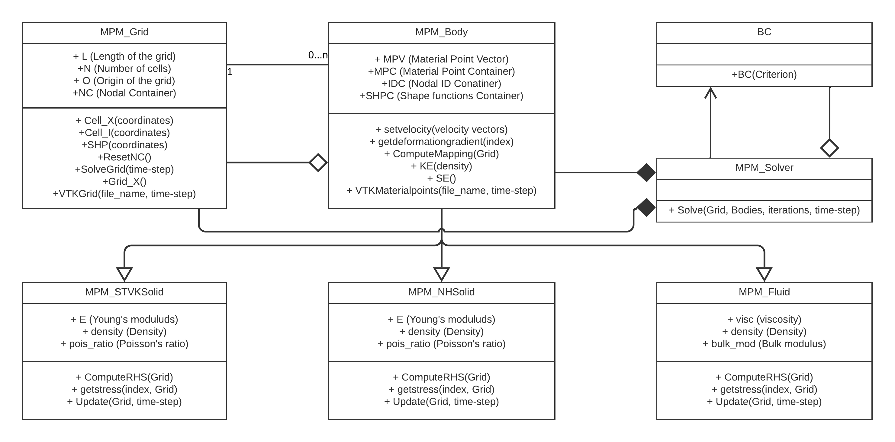

# Material Point Method - 2D
This project showcases the ability of Material Point Method[[1]](#1) by studying a variety of problems in solid and fluid mechanics, which involves large deformation, contact and fluid-solid interaction. The results are also validated using benchmarks provided by literatures. Two solid model and one fluid model is implemented. The constitutive laws used for solids are the St. Venant-Kirchoff law a Neo-Hookean type elasticity. A Velocity-Verlet time integration scheme is used for temporal discretization.

# Numerical Examples

## 1D Spring

The deformation of a damped 1D Spring is analysed and is compared with its analytical solution. A Diaplacement vs. time graph is plot, and is observed that the obtained values are closer. 

<p align="center">
  
</p>

## 2D Truss
A convergence study is made on a 2D truss under its self weight and the effect of Poisson's ratio on a 2D elongation is studied. The below series of images show the effect of Poisson's ratio. 

<p float="left">
  
   
  
  
</p>

## Two Disks

A analysis is made on two disks moving towards each other. This problem also gives an insight on the contact made between two bodies. The disks come into contact and they drift apart due to the generated stresses. The below set of images show the stresses generated in the disks. The scenes are taken from paraview. [[5]](#5)

<p float="left">
  
   
  
  
</p>

## Fluid flow with barrier

A liquid column initially at rest is allowed to flow under the influence of gravity only. The viscosity of the fluid is varied and its effect is studied. The below series of images show a flow behaviour of a less viscous fluid. [[3]](#3)

<p float="left">
  
   
  
</p>

## Fluid Impact

A drop of liquid is allowed to fall into a liquid mass initially at rest. The bulk-modulus of the fluid is varied and its effect is studied. The below series of images show a flow behaviour of a fluid with lower bulk-modulus.[[4]](#4)

<p float="left">
  
   
  
  
</p>

# USL Algorithm
At first, the mass, volume, velocity, force of each material point is mapped onto the respective grid nodes. Then the parameters are transformed into nodal values using shape functions. These local nodal values are assembled into the global matrices and the momentum equations are solved on the grid. The obtained nodal values are then remapped to the material points with which, the position of the material points is updated. At last, stresses are updated for each material point. The algorithm flow is shown below.

<p align="center">
  
</p>


# Code structure
This MPM solver is written in C++ and has a grid class, a body class and a solver class. Two solid body classes with St.Venant Kirchoff and Neo-Hookean material laws respectively and a fluid body class inherits from the parent class. The bodies returns a batch of vtk files and the post-processing is performed in paraview. An API is also developed using [pybind11](https://pybind11.readthedocs.io/en/stable/basics.html) to widen the scope of postprocessing. The UML diagram for the project is shown below.



## Description

`MPM_Grid`: Defines the Cartesian grid and discretizes it into cells. It also holds the Nodal Container(NC) and computes the nodal solution in the analysis. NC stores material point properties in a matrix format.

`NC` contains nodal masses, momentum, forces, acceleration, velocity and displavement and values are stored in the following order

```
Nodal masses        | Nodal momentum (X)    | Nodal momentum (Y)        |

Nodal forces (X)    | Nodal forces (Y)      | Nodal acceleration (X)    | Nodal acceleration (Y)|

Nodal velocity (X)  | Nodal velocity (Y)    | Nodal displacecment (X)   | Nodal displacement (Y)|
```

`MPM_Solver`: This class is used to provide the Update Stress Last (USL) solution algorithm. It is the link between grids and bodies in an analysis.

`BC`: Enforces the boundary conditions onto the grid

`MPM_Body`: Defines the body and discretizes it into material points. It also assembles the global matrices and returms the vtk files. The body can be discretized only into simple geometries of rectangle and circle. Material point discretization is done by function calls from the below files

```
mpm_rect.py
mpm_circ.py
```
The function call yields the Matrial Point Vector (MPV)

`MPV` conatins the X and Y coordinates and the volume of each material point

Each MPM_Body stores the data of its material points in a matrix format, i.e. kinematic data and state variables (MPC), current surrounding cell (IDC) and current shape functions for mapping to the same

`MPC` is the Material Point Container has 19 columns with data stored in the following order

```
X Coordinate                  | Y Coordinate                  |
    
Velocity in X direction       | Velocity in Y direction       | Volume per particle           |
    
Cauchy Stress along XX        | Cauchy Stress along XY        | Cauchy Stress along YY        | Cauchy Stress along ZZ        |

Deformation Gradient along XX | Deformation Gradient along XY | Deformation Gradient along YX | Deformation Gradient along YY |

Velocity Gradient along XX    | Velocity Gradient along XY    | Velocity Gradient along YX    | Velocity Gradient along YY    |

Gravity along X               |  Gravity along Y              |
```

`IDC` stores the local nodal index for each material point in the following order
```
Node 1 | Node 2 | Node 3 | Node 4 |
```

`SHPC` is the Shape function container for each material point and stores the shape functions and derived shape functions in the following order
```
Node 1 ->   Shape function | Derived shape function wrt X | Derived shape function wrt Y |,

Node 2 ->   Shape function | Derived shape function wrt X | Derived shape function wrt Y |,

Node 3 ->   Shape function | Derived shape function wrt X | Derived shape function wrt Y |,

Node 4 ->   Shape function | Derived shape function wrt X | Derived shape function wrt Y |.
```

The below three children classes inherit from the parent body class.

`MPM_STVKSolid`: Updates the stress following St. Vernant-Kirchoff material law. 

`MPM_NHSolid`: Updates the stress following Neo-Hookean material law. Generally preferred for large deformations.

`MPM_STVKSolid`: Updates the stress following aforementioined constitutive law. The bulk modulus value influences the compressibiliy of the fluid.

## References
<a id="1">[1]</a> 
D Sulsky, Z. Chen, and H.L. Schreyer.
A particle method for history-dependent materials. 
Computer Methods in Applied Mechanics and Engineering, 118(1-2):179–196, 1994.

<a id="3">[2]</a> 
X. Zhang, Z. Chen, and Y. Liu. 
The material point method: a continuum-based particlemethod for extreme loading cases. 
Elsevier Science, 2016.

<a id="2">[3]</a> 
C. Mast, P. Mackenzie-Helnwein, Arduino.P, G. Miller, and W. Shin. 
Mitigating kinematiclocking in the material point method. 
Journal of Computational Physics, 231(16):5351–5373, 2012.

<a id="2">[4]</a> 
L. Cueto-Fergueroso, I. Colominas, G. Mosqueira, F. Navarrina, and M. Casteleiro. 
On the galerkin formulation of the smoothed particle hydrodynamics method. 
International Journal for Numerical Methods in Engineering, 60(9):1475–1512, 2004.

<a id="5">[5]</a> 
https://www.researchgate.net/profile/Vinh_Phu_Nguyen/publication/262415477_Material_point_method_basics_and_applications/links/00463537ab99f084f0000000/Material-point-method-basics-and-applications.pdf